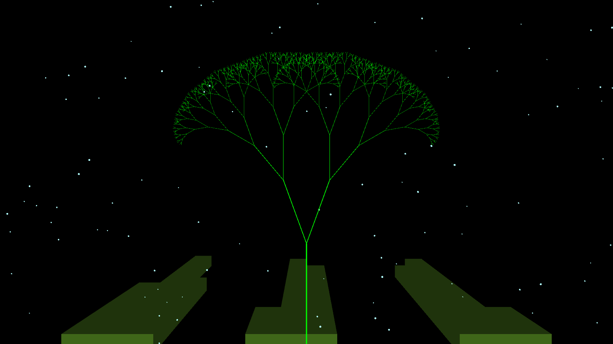
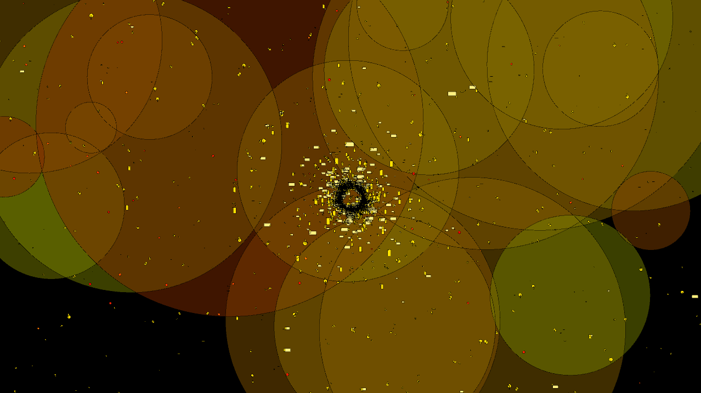
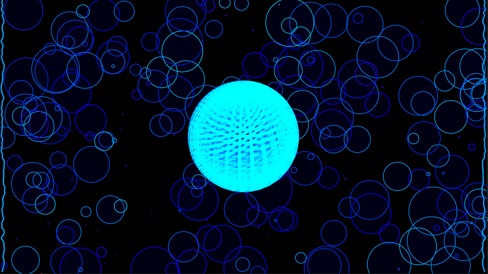
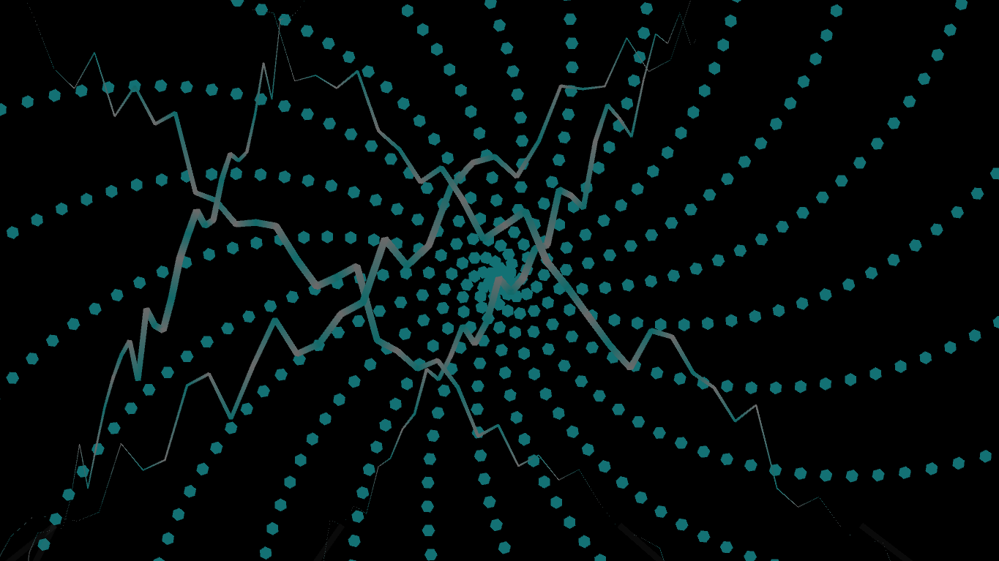

# Music Visualiser Project


| Name                  | Student Number    | Music Visuals | Github users|
|-----------            |-----------        |-----------	|-------------|
|Muhammad Zayan Zahid	|C22480092 			|Air  			|momo858|
|Sean Laureta			|C22503056			|Earth       	|seanl1213|
|Emma Radojcic         	|C22369396      	|Water 			|Danielr147 & Emmaradojcic|
|Ismail	Khan			|C22391076			|Fire			|ik24366|

# Description of the assignment 

This audio music visualizer features four distinct elemental visuals representing *Fire, Water, Earth, and Air*. Each visual responds to a fan-made remix of the "Avatar: The Last Airbender" soundtrack by Samuel Kim Music.

## Video goes heya

# Instructions
- To run these Music Visuals, you do these following steps:
- Debug and run the Java file called Main.java.
- Press 1 = Earth, 2 = Fire, 3= Water, 4 = Air, keys to run each Music Visuals.
- By pressing the 5 key you will exit the program.


# How it works

Our music visualizer project is structured using individual files holding our respective visuals. The main Java file, Main.java, executes our code, while Avatar.java combines the individual visuals from separate files. Each file is named after our student number. Under our student number folders, we have contained each of our visuals, which makes it easier to locate each one.

We created a class called Avatar that extends the Java Visuals file. This class takes all the functions and imports we have created and applied in Visuals to be extended to our Avatar file. We then declared each variable without initializing them, assigning short names to our visuals, such as referring to the Earth Visual as "ev". In our setup, we read in our song and prepared it with different functions to be used in our visuals. We used keyboard inputs from 1 to 5 to run each of our visuals.

### Earth


This Java program creates a visual representation of my take on the Earth aspect scene in "Avatar the Last Air Bender" using the Processing library. It incorporates elements such as a dynamic tree, columns, and background particles to generate an immersive environment. 

The program utilises arrays to store the properties of the background particles (speed, position and size). 

There are five main methods to the code: 

1. 'initializeBackgroundParticles()': 
	This method ensures variation in appearance and movement by initializing properties such as position, speed, and size for background particles.

2. 'draw ()':
	Renders the entire scene by clearing the background, setting up lighting effects, drawing background particles, calculating amplitude, drawing the tree, and rendering columns.

3. 'drawTree(float h, float brightness)':
	Creates the tree structure, adjusting branch length and angle based on amplitude and brightness. It recursively draws a tree with branches based on the given height and brightness.

4. 'drawColumns()':
	Creates columns at the bottom of the screen, with heights changing based on amplitude and utilizing color gradients for a realistic 3D appearance. This method draws architectural columns on the screen with heights determined by amplitude, creating a gradient effect.

5. 	'drawBackgroundParticles()':
	 Draws background particles that move upwards on the screen and resets them when they go out of view. These particles contribute to the atmosphere of the scene, creating an out of this world ambiance.

### Fire

1. Properties:
- amplitude: Stores the audio level.
- fv: Reference to the main program.
- fireballs: Array for simulating fireballs.
- fireParticles: Array for simulating rising fire particles.
- n1 and n2: Control variables for movement.
2. Draw Method:
- Gets audio level and sets color mode.
- Draws fireballs and fire particles.
- Iterates through audio buffer, calculating positions based on current frame and audio level.
- Draws shapes (circles and rectangles) based on audio level, using left and right channels.
- Increments control variables for movement.
3. Fireball Class:
- Represents a fireball with position, size, speed, and color.
- Updates size and position, randomizing if beyond screen.
- Displays fireball as a semi-transparent ellipse with a red stroke.
4. FireParticle Class:
- Represents a rising fire particle with position, speed, size, and color.
- Updates position by moving upwards, wrapping around if off-screen.
- Displays particle as an ellipse with a color from yellow to orange.

### Water

My Java program uses the Processing framework to paint a picture with music, focusing on the theme of water. The visual output presents circles resembling raindrops, an orb that simulates a bubble, and waves that add to the overall water theme.

The program has classes such as Circle.java, Particle.java, and Wave.java, which together create a dynamic aquatic landscape. The movement and appearance of these elements are driven by properties like size, growth rate, and position, which are adjusted in real-time based on the audio input to replicate the natural behaviours of water.

An instance of the main WaterVisual class brings the visualization to life. Here, the central orb, drawn by the drawRotating3DOrb function, becomes the focal point, pulsating and spinning in sync with the music. Its enhanced by the Processing lighting functions,making it glow like a mysterious object under the sea.

The draw method is the important part of the visualization. It paints a dark background to mimic the depths of the ocean, over which the raindrop circles expand and the particles rise like tiny bubbles. This backdrop ensures smooth transitions between frames.

The program's use of vibrant HSB colors brings the scene to life. The audio's amplitude is carefully analyzed to modulate the brightness and saturation, making the visualization pulse with the music. This is evident as the circles, meant to be simulated raindrops, grow in size and the particles drift upwards, reacting to the flow of the audio.

In terms of rendering the shapes, the program employs loops that iterate through angles to plot the points of the circles. The calculated coordinates ensure that each circle expands outward from its origin, and with added rotation around the z-axis, the visualization adds a sense of depth and fluid motion.

The properties that dictate motion such as the angle increments and speed are continuously updated, giving the impression that the water elements are swaying to the music. The overall effect is a peaceful and engaging visual that matches the chosen music, reflecting the calm but changeable nature of water.
### Air



This Java program creates a 2D audio visualization using the Processing library and Minim audio library. The program displays hexagons that change size and color based on the audio levels of "Avatar.mp3". The code utilizes two other classes, ShapeDraw.java and Lightning.java, to visualize a hurricane of hexagons that produce lightning.

The properties of Air.java are spinAngle, motion, motionSpeed, and speed. These variables control the movement and speed of the hexagons dynamically. There is an instance of the Avatar class and Lightning class.

I have constructed the AirVisual class with an instance of the Avatar class and also created an instance of the Lightning class, passing the Avatar instance to it, which allows the Lightning class to be used in the visualization.

In the draw method, we first call the lightning method that creates lightning from the top of the screen to the bottom and draws a lightning bolt. We set up the background with a black transparent rectangle that allows better transitions through the frames.

Using a loop of the buffer size, the color is set to use HSB colors to be more vibrant. We calculate the amplitude of the left audio channel and map it to a value that determines the brightness of the color, making the visualization react to the music's volume. We call the method ShapeDraw that draws hexagons and places them using the amplitude of the left level of the song and the buffer size. 

How the method ShapeDraw draws hexagons is through a loop that iterates through angles from 0 to 360 degrees with increments of 60 degrees. Each pass adds another line hexagon. For each angle, the method calculates the x and y coordinates of a vertex. The calculations use the cosine and sine of the angle converted to radians multiplied by the radius. This determines how far from the center point (centerX) each vertex is placed, and a line is drawn to each vertex, closing the shape. The hexagons are then rotated around the z-axis. The motion variables (motion, x, y) are updated to make the hexagons move. They gradually translate across the screen in a circular path due to the sine and cosine wave functions. The spinAngle and motionSpeed are incremented to update the movement and rotation over the period of the song.

# What I am most proud of in the assignment

#### Emma
I am most proud of 


#### Sean 
What I am most proud of in this assignment is the learning process how to code in java in a unique and fun way. I did not realise there was more to coding than just maintaining code or making websites etc. there is a fun way to code and learn and to try new things.
I am happy that the code ended up working and I got to learn how to work as a group to create art through code.

#### Muhammad Z

What I'm most proud of in this assignment was probably learning that I can make art with code. I never expected that coding, which I always thought was analytical and straightforward, can bend and mold into an art form that can produce amazing visuals that only your imagination can limit. Another thing I'm proud of is learning how to use Processing and math with Processing to create amazing visual art, especially using sine and cosine to make spirals that look really trippy and hypnotizing to watch.

#### Ismail

# Markdown Tutorial

This is *emphasis*

This is a bulleted list

- Item
- Item

This is a numbered list

1. Item
1. Item

This is a [hyperlink](http://bryanduggan.org)

# Headings
## Headings
#### Headings
##### Headings

This is code:

```Java
public void render()
{
	ui.noFill();
	ui.stroke(255);
	ui.rect(x, y, width, height);
	ui.textAlign(PApplet.CENTER, PApplet.CENTER);
	ui.text(text, x + width * 0.5f, y + height * 0.5f);
}
```

So is this without specifying the language:

```
public void render()
{
	ui.noFill();
	ui.stroke(255);
	ui.rect(x, y, width, height);
	ui.textAlign(PApplet.CENTER, PApplet.CENTER);
	ui.text(text, x + width * 0.5f, y + height * 0.5f);
}
```

This is an image using a relative URL:


This is an image using an absolute URL:


This is a youtube video:

[](https://www.youtube.com/watch?v=J2kHSSFA4NU)


